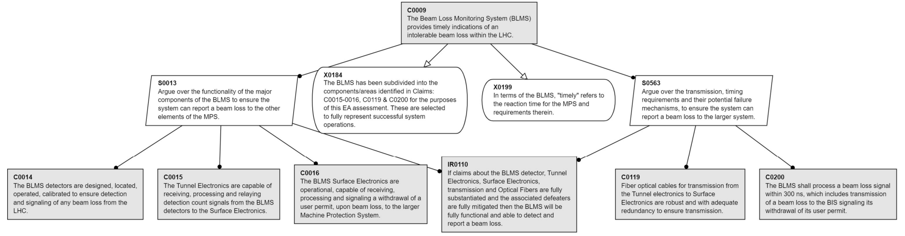
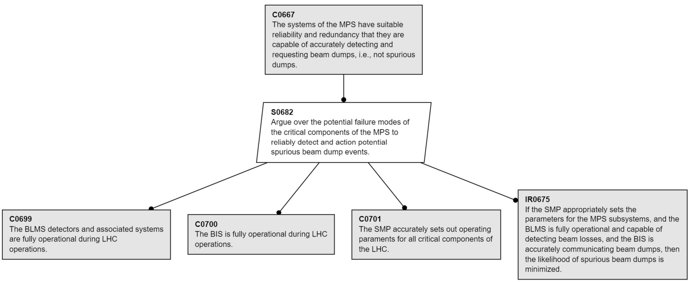

# CERN Large Hadron Collider (LHS) Machine Protection System (MPS)
(Description taken from [CERN](https://home.cern/science/accelerators/large-hadron-collider) and [MPS Assurance Case](https://cds.cern.ch/record/2854725/files/LHC%20MPS%20-%20Original%20EA_argument%20%2B%20Preamble.pdf?version=2)):

The Large Hadron Collider (LHC) is the world’s largest and most powerful particle accelerator that pushes protons or ions to near the speed of light. It first started up on 10 September 2008, and remains the latest addition to CERN’s accelerator complex. The LHC consists of a 27-kilometre ring of superconducting magnets with a number of accelerating structures to boost the energy of the particles along the way. The accelerator sits in a tunnel 100 metres underground at CERN, the European Organization for Nuclear Research, on the Franco-Swiss border near Geneva, Switzerland.

A top-level claim about the MPS is supported by a structured argument represented via Eliminative Augmentation (EA), a variant of the well-known Goal Structuring Notation (GSN). EA involves the explicit representation and reasoning about potential doubts within the argument, in order to effectively eliminate or address them. 
## Defeater Cards
The following defeaters were adapted from:
[LHC Machine Protection System Assurance Case](https://cds.cern.ch/record/2854725/files/LHC%20MPS%20-%20Original%20EA_argument%20%2B%20Preamble.pdf?version=2)

* [Communication Delays](https://github.com/UsmanGohar/Defeater-Cards/blob/main/defeater_cards/CERN/communication-delays.md)

* [Sufficient Redundancy](https://github.com/UsmanGohar/Defeater-Cards/blob/main/defeater_cards/CERN/sufficient_redundancy.md)

## Card Creation Walkthrough
WIP

### Paper
Millet, L. et al. (2023). Assurance Case Arguments in the Large: The CERN
LHC Machine Protection System. In: Guiochet, J., Tonetta, S., Bitsch, F.
(eds) Computer Safety, Reliability, and Security. SAFECOMP 2023. Lecture
Notes in Computer Science, vol 14181. Springer, Cham.
https://doi.org/10.1007/978-3-031-40923-3_1
