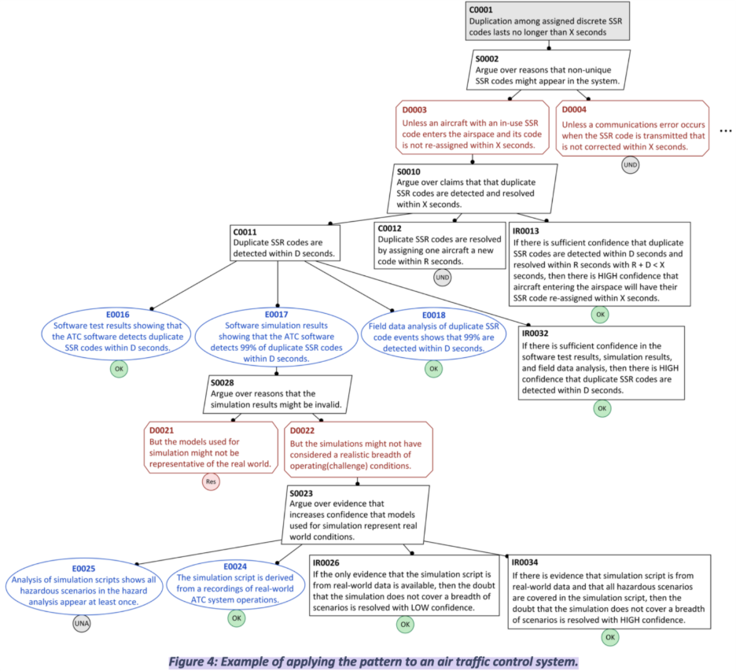

# Air Traffic Control Systems
(Description taken from faa.gov): "The primary purpose of the ATC system is to prevent a collision involving aircraft operating in the system. In addition to its primary purpose, the ATC system also: Provides a safe, orderly, and expeditious flow of air traffic..."

## Defeater Cards
The following defeaters were adapted from: \
 S. Diemert, J. Goodenough, J. Joyce, and C. Weinstock, “Incremental Assurance Through Eliminative Argumentation,” Journal of System Safety, vol. 58, no. 1, pp. 7–15, Mar. 2023, doi: 10.56094/jss.v58i1.215
 
 * [Realistic Simulation](https://github.com/UsmanGohar/Defeater-Cards/blob/main/defeater_cards/air_traffic_control_systems/atc_realistic_simulations.md)
 * [SSR Duplication](https://github.com/UsmanGohar/Defeater-Cards/blob/main/defeater_cards/air_traffic_control_systems/atc_ssr_duplication.md)
## Card Creation Walkthrough
WIP

### References